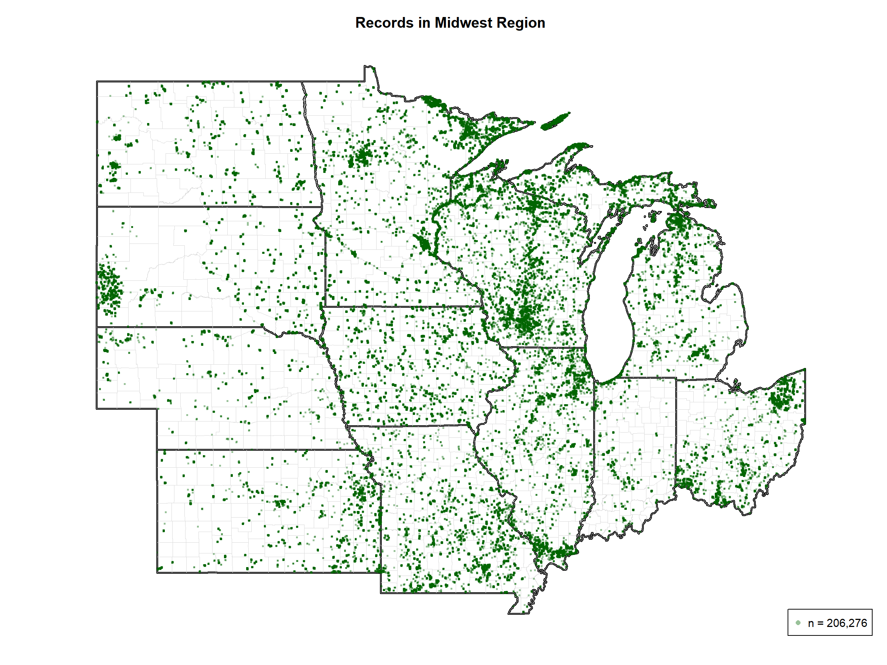

# Herbarium Specimen Distribution Maps
## Regional Overview - Preview Document

**Dataset:** NA_herb_09_10A.txt  
**Records with Valid Coordinates:** 1,685,432  
**Date Generated:** October 14, 2025

---

## Overview

This document displays the national and regional overview maps for herbarium specimen distributions across the contiguous United States. Maps show georeferenced collection localities with state boundaries (heavy black lines) and county boundaries (light gray lines) for geographic context.

It must be emphasized that plotted points are (obviously) restricted to records with decimalLatitude and decimalLongitude. Older material usually lacks such data, producing the appearanece of sparse sampling where infact many samples are present.

---

## Continental United States - All 48 States

Complete overview of specimen distribution across the 48 contiguous states.

**Download high-resolution PDF:** [US_All_48_States.pdf](regional_plots/US_All_48_States.pdf)

---

## Regional Maps

### West Region

**States:** Washington, Oregon, California, Nevada, Idaho, Montana, Wyoming, Utah, Colorado, Arizona, New Mexico (11 states)

**Download high-resolution PDF:** [US_West_Region.pdf](regional_plots/US_West_Region.pdf)

---

### Midwest Region

**States:** North Dakota, South Dakota, Nebraska, Kansas, Minnesota, Iowa, Missouri, Wisconsin, Illinois, Michigan, Indiana, Ohio (12 states)

**Download high-resolution PDF:** [US_Midwest_Region.pdf](regional_plots/US_Midwest_Region.pdf)

---

### South Region

**States:** Texas, Oklahoma, Arkansas, Louisiana, Mississippi, Alabama, Tennessee, Kentucky, West Virginia, Virginia, North Carolina, South Carolina, Georgia, Florida, Maryland, Delaware, District of Columbia (17 states)

**Download high-resolution PDF:** [US_South_Region.pdf](regional_plots/US_South_Region.pdf)

---

### Northeast Region

**States:** Pennsylvania, New Jersey, New York, Connecticut, Rhode Island, Massachusetts, Vermont, New Hampshire, Maine (9 states)

**Download high-resolution PDF:** [US_Northeast_Region.pdf](regional_plots/US_Northeast_Region.pdf)

---

## Map Features

- **Coordinate precision:** Rounded to 2 decimal places (≈1.1 km)
- **Jitter:** None for national map, 0.05% Gaussian for regional maps
- **State boundaries:** Black, 2.5 pt weight (prominent)
- **County boundaries:** Gray85, 0.25 pt weight (subtle reference)
- **Data points:** Green with 40% transparency, cex = 2.5
- **Image resolution:** 200 DPI PNG for web display
- **PDF format:** Vector graphics for print quality

---

## Notes

**PNG files** are optimized for inline viewing in this document and web browsers. They display immediately and show good contrast for quick reference.

**PDF files** are vector format suitable for:
- High-quality printing
- Detailed examination (infinite zoom)
- Publication and presentation use
- Editing in graphics software

---

*Preview document created: October 14, 2025*
